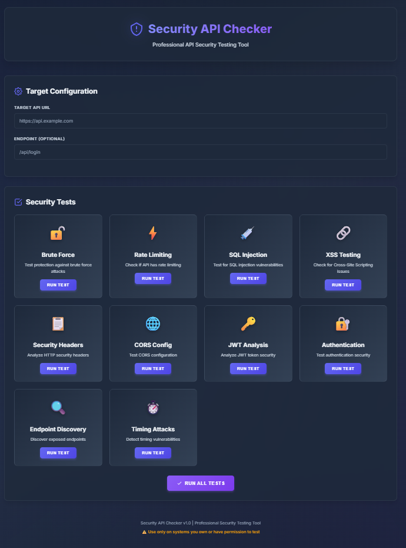

# 🔒 Security API Checker



Hey there! Welcome to **Security API Checker**.

I built this tool because I really missed having something simple, visual, and straight to the point to play test the security of my APIs. The idea isn't to replace a full Red Team squad, but to give you a quick way to validate that you haven't left any obvious doors wide open in your backend.

Basically, think of it as a "control panel" where you can throw various controlled attacks at your own API and see how it holds up.

## ⚠️ Before you start (Very Important)

**Be responsible.**
This tool is powerful and simulates real attacks. Use it ONLY on systems that you own or have explicit written permission to test. Testing third-party systems without authorization is illegal and, honestly, not the vibe of someone who builds quality software.

---

## 🎯 What can you test?

The tool covers the most common vulnerabilities that usually slip through the cracks during development:

*   **Brute Force & Rate Limiting**: Can your API handle someone trying to guess passwords or spamming requests?
*   **Injections (SQL & XSS)**: Verify if you are sanitizing inputs properly or if someone can inject malicious code.
*   **Security Headers**: Analyzes if your server is sending the correct HTTP headers to protect the client.
*   **JWT & Authentication**: Take a peek at your tokens and login mechanisms looking for configuration flaws.
*   **CORS**: Confirm you aren't accepting requests from weird origins.
*   **And more...**: Detection of exposed endpoints, timing attacks, etc.

All of this comes with a GUI (because nobody deserves to read giant JSONs in the terminal all day) that shows you results with colors and severity levels.

## 🚀 How to get this running

It's a standard Node.js project, so it's pretty straightforward.

1.  **Install dependencies:**
    ```bash
    npm install
    ```

2.  **Start the server:**
    ```bash
    npm start
    ```
    (Or `npm run dev` if you want it to restart when you change code).

3.  **Open browser:**
    Go to `http://localhost:3000`.

## 📖 How to use

The interface is quite self-explanatory:
1.  Put in your API URL (like `http://localhost:8080` or your dev server).
2.  Choose which test you want to run (or run them all in sequence).
3.  Check the report.

If there are issues, the tool tries to explain what's wrong and gives you some tips on how to fix it (like "Hey, enable HSTS" or "Your rate limit is too permissive").

## 🛠️ For those who like automation (API)

If you prefer to integrate this into other scripts, all tests are available via REST endpoints. You can POST directly to our backend:

*   `POST /api/security/test/brute-force`
*   `POST /api/security/test/sql-injection`
*   The rest can be found in the docs or by exploring the UI.

### Example JSON request:

```javascript
POST /api/security/test/brute-force
{
  "targetUrl": "https://api.yourpage.com",
  "endpoint": "/login",
  "usernameField": "email",
  "passwordField": "pass",
  "attempts": 50
}
```

## 🤝 Contributing

This is a personal project I use in my dev work. Feel free to fork, improve the code, or adapt it to your needs. If you find bugs or have new ideas, let me know!

Have fun (safely)! 🛡️
